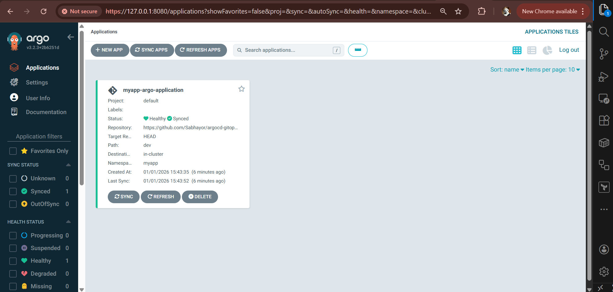

# Application Deployment and Management in ArgoCD

### Objective

Learn how to define and deploy applications using ArgoCD in a Kubernetes environment.

---

### Step 1: Understand the ArgoCD Application Concept

In ArgoCD, an **Application** is a Kubernetes custom resource (CRD) that declaratively defines:

* **Where your application manifests live** (Git repository)
* **Which revision to track** (branch, tag, or commit)
* **Where to deploy** (cluster and namespace)
* **How ArgoCD should manage it**

ArgoCD continuously compares the *desired state* in Git with the *live state* in the cluster.

---

### Step 2: Create the Application Definition

Create a file named `application.yaml`.

```yaml
apiVersion: argoproj.io/v1alpha1
kind: Application
metadata:
  name: myapp-argo-application
  namespace: argocd
spec:
  project: default
  source:
    repoURL: https://github.com/Sabhayor/argocd-gitops-application-management.git
    targetRevision: HEAD
    path: dev
  destination: 
    server: https://kubernetes.default.svc
    namespace: myapp

  syncPolicy:
    syncOptions:
    - CreateNamespace=true

    automated:
      selfHeal: true
      prune: true
```

#### Explanation

* **apiVersion / kind**: Declares this as an ArgoCD Application CRD
* **metadata.name**: Name of the application as it appears in ArgoCD
* **metadata.namespace**: Must be `argocd`, where ArgoCD is installed
* **spec.project**: Logical grouping within ArgoCD (default project used here)
* **spec.source.repoURL**: Git repository containing Kubernetes manifests
* **spec.source.path**: Directory within the repo where manifests are stored
* **spec.source.targetRevision**: Git branch, tag, or commit (e.g., `main`, `v1.0.0`)
* **spec.destination.server**: Kubernetes API server address
* **spec.destination.namespace**: Target namespace for deployment

---

### Step 3: Deploy the Application

Apply the application definition to the cluster.

```bash
kubectl apply -f application.yaml -n argocd
```

#### What Happens Next

* ArgoCD detects the new Application resource
* It pulls manifests from the specified Git repository
* It compares desired state (Git) with live state (cluster)
* The application appears in the ArgoCD UI

At this point, the application may show as **OutOfSync** until you explicitly sync it.

---

## Managing Application Lifecycle

### Objective

Understand how to manage application lifecycle events such as syncing, monitoring health, and rolling back deployments.

---

### Step 1: Syncing the Application

Syncing tells ArgoCD to apply the desired state from Git to the cluster.

```bash
argocd app sync myapp-argo-application
```

#### Explanation

* ArgoCD applies Kubernetes manifests from the Git repository
* Resources are created, updated, or pruned as needed
* The application transitions to a **Synced** state

You can also perform this action via the ArgoCD UI using the **SYNC** button.


---

### Step 2: Monitoring Application Health and Status

Check application details using the CLI.

```bash
argocd app get sample-app  

```

#### Key Information Provided

* **Sync Status**: Synced or OutOfSync
* **Health Status**: Healthy, Degraded, or Progressing
* **Resources**: Pods, Services, Deployments managed by the app

In the UI, this information is visualized as a resource tree, making troubleshooting easier.

---

### Step 3: Performing Rollbacks

ArgoCD keeps a deployment history, allowing safe rollbacks.

```bash
argocd app rollback sample-app
```

#### Explanation

* Reverts the application to the previously deployed Git revision
* Useful when a new change introduces errors
* Rollbacks are declarative and auditable

You can also select a specific revision to roll back to via the UI.

---

## Structuring Git Repositories for Optimal ArgoCD Use

### Objective

Learn how to structure Git repositories effectively for scalable and maintainable GitOps workflows.

---

### Step 1: Recommended Repository Structure

A clean repository structure improves clarity and environment isolation.

```text
├── k8s/
│   ├── dev/
│   │   └── deployment.yaml
│   └── prod/
│       └── deployment.yaml
├── src/
└── README.md
```

#### Explanation

* **k8s/**: Contains all Kubernetes manifests
* **dev / prod**: Environment-specific configurations
* **src/**: Application source code (optional for GitOps repo)
* **README.md**: Documentation for maintainers

ArgoCD applications can point to different paths for each environment.

---

### Step 2: Environment Separation Strategies

Common approaches include:

* **Directory-based**: Separate folders per environment (recommended for beginners)
* **Branch-based**: Separate Git branches (e.g., `dev`, `staging`, `prod`)

Directory-based separation is simpler and works well with ArgoCD's declarative model.

---

### Step 3: Version Control Best Practices

Follow these Git best practices:

* Use meaningful commit messages (e.g., `feat: update replica count for prod`)
* Avoid direct changes in the cluster; commit to Git instead
* Use Git tags or releases for stable application versions
* Review changes via pull requests before merging

These practices ensure traceability, auditability, and easy rollback.

---


#### Commands

```bash
# install ArgoCD in k8s
kubectl create namespace argocd
kubectl apply -n argocd -f https://raw.githubusercontent.com/argoproj/argo-cd/stable/manifests/install.yaml

# access ArgoCD UI
kubectl get svc -n argocd
kubectl port-forward svc/argocd-server 8080:443 -n argocd

# login with admin user and below token (as in documentation):
kubectl -n argocd get secret argocd-initial-admin-secret -o jsonpath="{.data.password}" | base64 --decode && echo

# you can change and delete init password

```
</br>

#### Links

* Config repo: [https://gitlab.com/nanuchi/argocd-app-config](https://gitlab.com/nanuchi/argocd-app-config)

* Docker repo: [https://hub.docker.com/repository/docker/nanajanashia/argocd-app](https://hub.docker.com/repository/docker/nanajanashia/argocd-app)

* Install ArgoCD: [https://argo-cd.readthedocs.io/en/stable/getting_started/#1-install-argo-cd](https://argo-cd.readthedocs.io/en/stable/getting_started/#1-install-argo-cd)

* Login to ArgoCD: [https://argo-cd.readthedocs.io/en/stable/getting_started/#4-login-using-the-cli](https://argo-cd.readthedocs.io/en/stable/getting_started/#4-login-using-the-cli)

* ArgoCD Configuration: [https://argo-cd.readthedocs.io/en/stable/operator-manual/declarative-setup/](https://argo-cd.readthedocs.io/en/stable/operator-manual/declarative-setup/)
